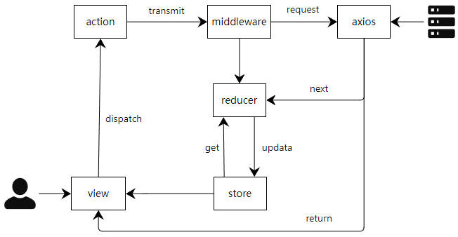

<a href="./README_en.md" style="text-decoration: none;">
<a href="./README.md" style="text-decoration: none;">
<a href="https://github.com/chenmeilong/FileMaster-frontend" style="text-decoration: none;">
<a href="https://github.com/chenmeilong/FileMaster-backend" style="text-decoration: none;">

## 功能
- 可展开的文件夹树
- 列表视图和网格视图
- 小图标和缩略图切换
- 重载文件夹树和文件夹内容
- 拖放操作实现文件和文件夹的移动
- 右键菜单实现管理文件和文件夹
- 文件和文件夹的多选功能，包括全选、取消全选、反选和单击选择
- 排序文件和文件夹：按日期、大小、名称（升序、降序）
- 导航路径，包括后退、前进和返回根目录
- 复制、粘贴、快速复制、删除、新增和重命名文件夹和文件
- 清空文件夹内容
- 选择、拖放实现多文件上传
- 解压缩、压缩指定文件
- 显示文件和文件夹的详细信息
- 图片编辑和预览功能
- 下载文件
- 宽屏与窄屏模式切换
- 自动消失的气泡消息提示
- 选择文件夹或文件的底部提示

## 快速上手

1. 安装依赖环境
> `pnpm i`   or `yarn`

2. 启动项目
> `pnpm dev`  or `yarn dev`

## 自定义中间件架构图

## 待办
- [X] 自定义middleware实现API请求action化，提高API的可维护性
- [X] 操作的权限管理，不同的文件有不同功能disable
- [X] 拖动效果实现，文件或文件夹拖动到文件夹上方，文件夹会自动打开
- [X] 文件图标状态集中化管理
- [ ] 性能优化，使用useCallback 、useMemo等Hook来优化回调函数声明
- [ ] 消息提示窗体淡入淡出动画、完善消息队列
- [ ] 更加详细的类型定义
- [ ] 文本文件编辑、保存
- [ ] 文件拖动，选着移入，react-beautiful-dnd不支持该操作，需要更换react-dnd
- [ ] 文件搜索
- [ ] 保护文件不支持路径移动、删除、修改
- [ ] 按钮组组件合并
- [ ] 使用async、await的方式重构axios请求API
- [ ] 常用快捷键绑定
- [ ] 去掉TopBar、优化右键菜单
- [ ] 路径栏、路径跳转
- [ ] 主题自定义、窗口大小自定义
- [ ] 上线npm完善安装使用文档

## 贡献
欢迎PRs！如果你想为这个项目做贡献，你可以提交pr或issue，[待办](#待办)中有一些可以扩展的功能。我很高兴看到更多的人参与改进并优化它。